# Create a Linux Virtual Machine in Windows

Here are instructions to create and run a Linux virtual machine in Windows, using the VMware Workstation Player for Windows and CentOS Stream 9. This setup will allow you to write and run the Ansible playbooks in the tutorial. Once again, this is not the only way to use Linux with Windows, but reviewing every method is beyond the scope of this tutorial.

- [Download CentOS Stream](#download-centos-stream)
- [Download and Install VMware Workstation Player for Windows](#download-and-install-vmware-workstation-player-for-windows)
- [Create a Virtual Machine](#create-a-virtual-machine)
- [Setup CentOS](#setup-centos)
- [Login and Update the System](#login-and-update-the-system)

> **WARNING** - This is a living document that I will edit and update it whenever the CentOS Project updates CentOS Stream or VMware updates Workstation Player for Windows.

-----

## Download CentOS Stream

***CentOS Stream*** is a free and open-source Linux distribution maintained by the CentOS Project[^1]. CentOS Stream is based on Fedora Linux, and it is the community-supported upstream source for Red Hat Enterprise Linux (RHEL).

1. Open a browser and navigate to <https://www.centos.org/>:

    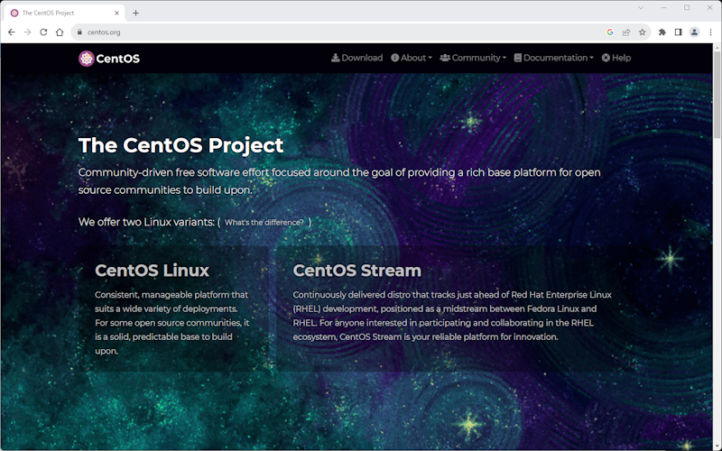

2. Click on the **Downloads** link at the top of the page. The **Download** page should appear:

    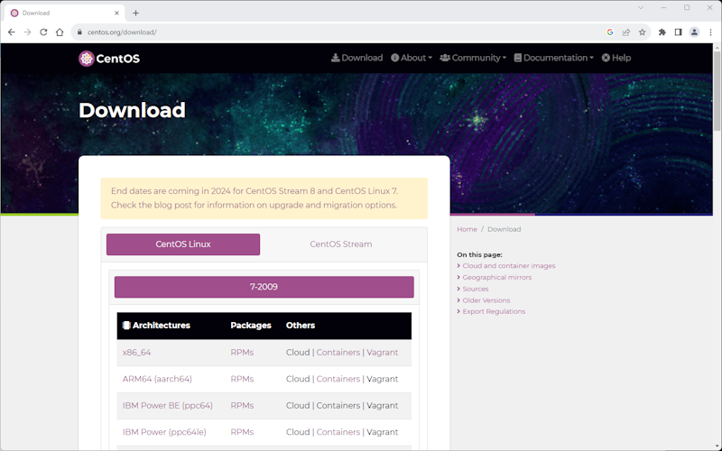

3. Click on the **CentOS Stream** tab and select the latest version of CentOS Stream:

    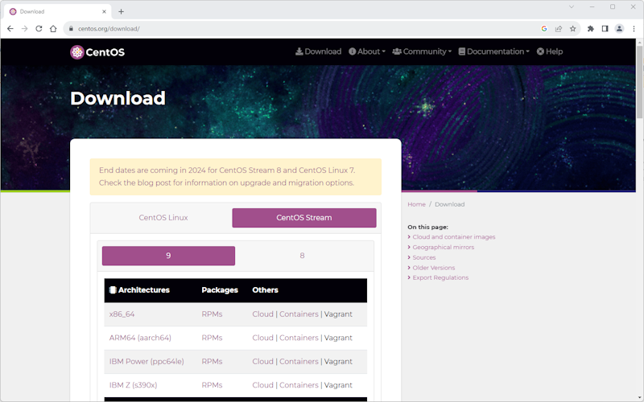

4. Click on the **x86_64** architecture link. Your browser should start downloading the image, and if it asks if you would like to open or save the file, click on **Save**. Wait until your browser completes the download, then open your **Downloads** folder. Check that the download was successful:

    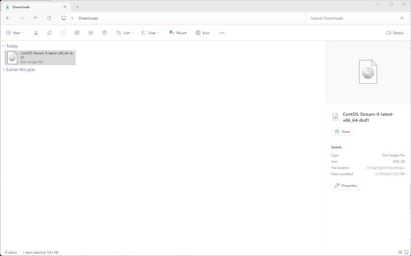

    > **NOTE** - By default, browsers will download the disk image to your **Downloads** folder. However, if you prefer not to store the image in that, you can move the image to another location. Just remember the location, so you can enter it into VirtualBox later on.

-----

## Download and Install VMware Workstation Player for Windows

***VMware Workstation Player*** is a Type-2 Hypervisor that can run virtual machines and appliances on multiple operating systems, including Windows. It is free for personal use.

The latest version of Workstation Player, version 17, is compatible with Windows 8.1 and Windows Server 2012 or later. However, you should use the VMware Compatibility Guide at <https://www.vmware.com/resources/compatibility/search.php> to ensure you use the version of Workstation Player that is compatible with your version of Windows.

1. Open a browser and navigate to <https://www.vmware.com>:

    

2. Click on the **Products** tab and select **Workstation Player**. You may also navigate directly to <https://www.vmware.com/products/workstation-player.html>:

    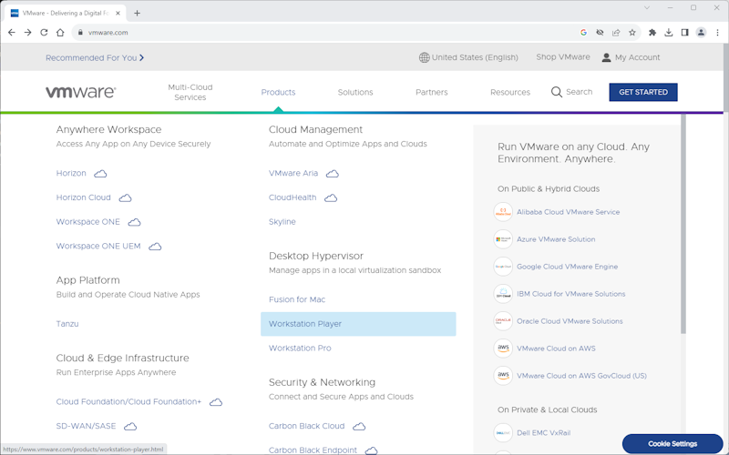

3. When the **VMware Workstation Player** page appears, click on the **DOWNLOAD FOR FREE** link:

    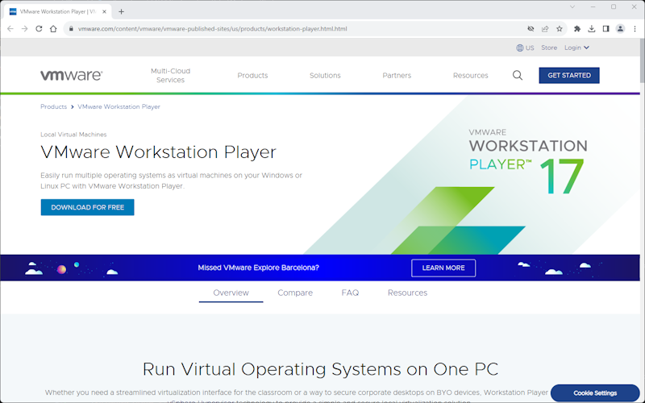

4. A new tab or window will open. Ensure you select the latest version, then click on the **GO TO DOWNLOADS** link:

    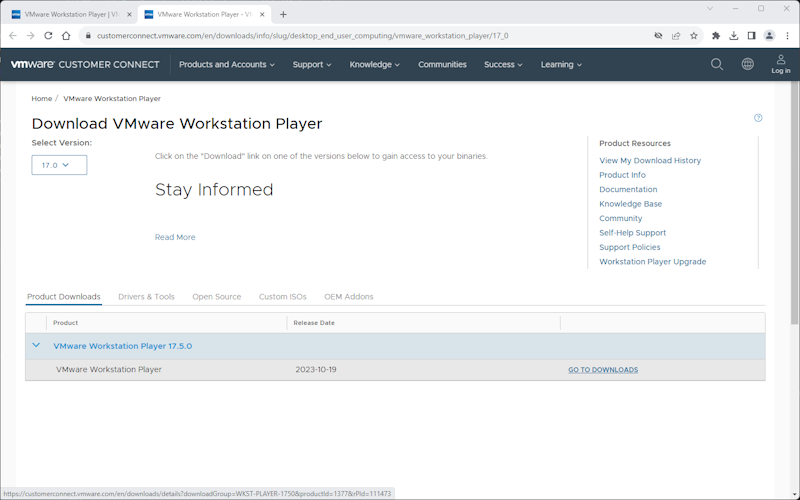

5. When the **Download** page appears, click on the **Download** button for VMware Workstation Player for Windows 64-bit Operating Systems:

    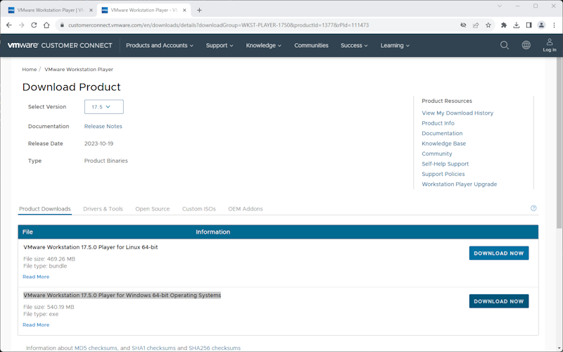

6. Your browser should start downloading the file, and if it asks if you would like to open or save the file, click on **Save**. Wait until your browser completes the download, then open your **Downloads** folder. Right-click on the downloaded file and select **Run as administrator**:

   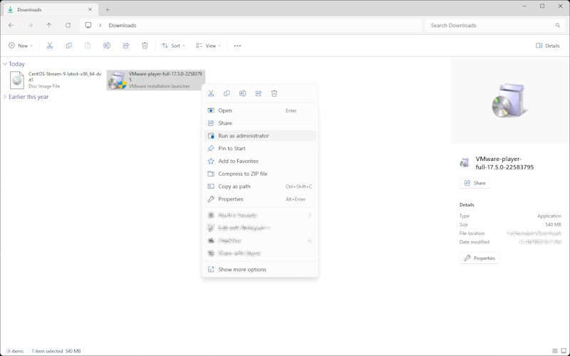

7. If your system's User Account Control asks, ***"Do you want to allow this app to make changes to your device?"***, click on **Yes**:

   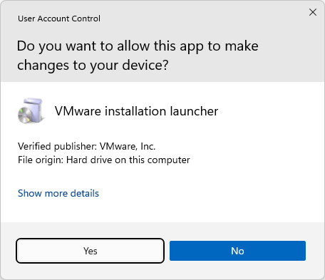

8. When the ***Welcome to the VMware Workstation 17 Player Setup Wizard*** dialog appears, click on **Next**:

   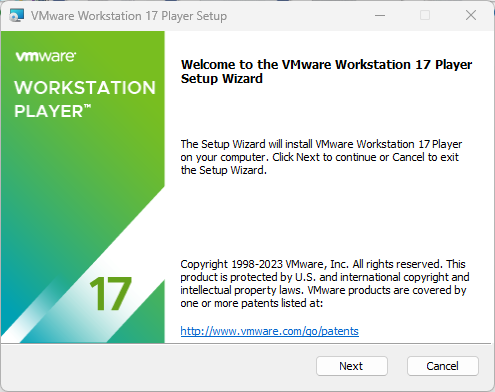

9. The End-User License Agreement (EULA) will appear. Once you have finished reading it, check **I accept the terms in the License Agreement** and click on **Next**:

   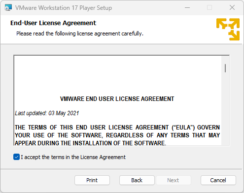

10. When the **Custom Setup** dialog appears, ensure the following options are set, click **Next** to continue:

    - **Install to** - This is the location of the VMware executables; the default value should work on your system.
    - **Enhanced Keyboard Driver** - This feature allows you to use key combinations, such as **[Ctrl]** + **[Alt]** + **[Del]** or **[Win]** + **[L]**, within the virtual machine without being intercepted by the Windows host operating system. It also allows to use additional features on international and non-standard keyboards. However, you will not use any special key combinations or require any special keyboard features in the tutorial, so you can leave this unchecked.
    - **Add VMware Workstation console tools into system PATH** - This option allows you to run VMware command-line interface (CLI) commands, such as **vmrun**, without having to prepend the path to the VMware executables. You can leave this checked, but you will not be using any console commands in the tutorial.

    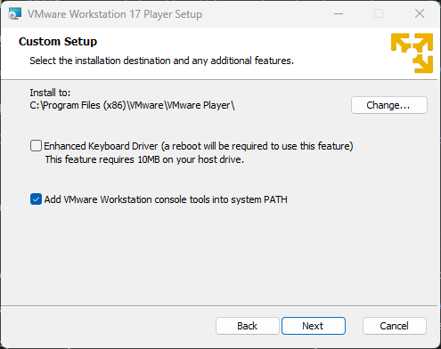

11. When the **User Experience Settings** dialog appears, ensure the following options are set, click **Next** to continue:

    - **Check for product updates on startup** - Leave this checked to ensure the application is up-to-date when opened.
    - **Join the VMware Customer Experience Improvement Program** - If you would like to join the program, leave this checked. However, you do not need to join the program to perform the tasks in the tutorial.

    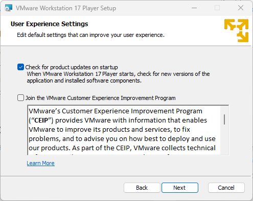

12. The **Shortcuts** dialog should appear. Leaving both options checked will make accessing your virtual machine easier. Click **Next** to continue:

    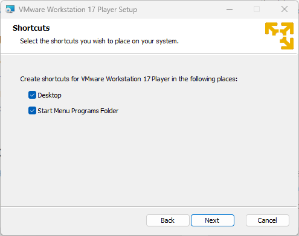

13. When the **Ready to install VMware Workstation 17 Player** dialog appears, click on **Install**:

    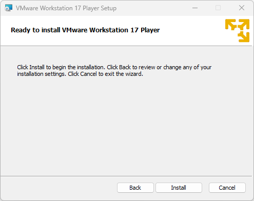

14. The wizard will start installing VMware Workstation 17 Player:

    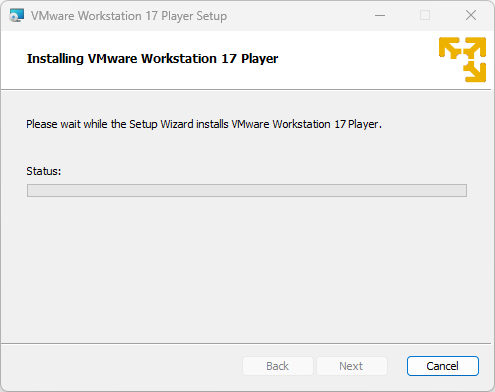

15. Click on **Finish** when the wizard tells you the installation is complete:

    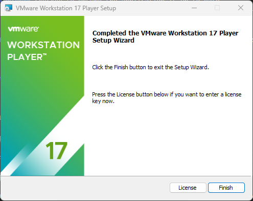

16. Go back to your Desktop. Select **All Apps** -> **VMware** -> **VMware Workstation 17 Player** from you application menu or click on the Workstation icon:

    

17. When VMware Workstation 17 Player starts, select **Use VMware Workstation 17 Player for free for non-commercial use** and click on **Continue**:

    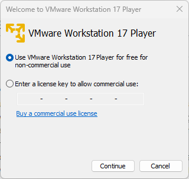

18. At the next dialog windows, click on **Finish**:

    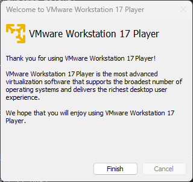

-----

## Create a Virtual Machine

1. When the VMware Workstation 17 Player welcome dialog appears, select **Create a New Virtual Machine**:

    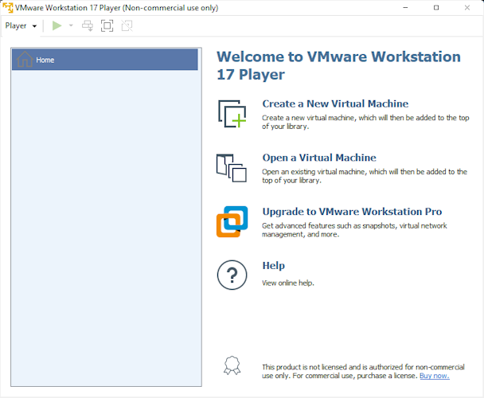

2. The **Welcome to the New Virtual Machine Wizard** dialog should appear. Select **I will install the operating system later** and click on **Next**:

   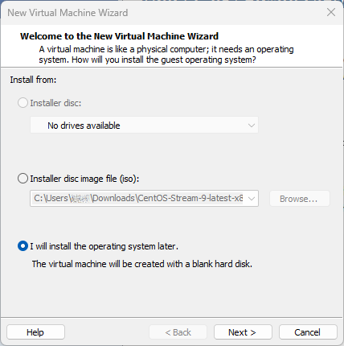

3. When the **Select a Guest Operating System** dialog appears, select **Linux** for the guest operating system and **Red Hat Enterprise Linux 9 64-bit** for the version (there is no option for CentOS 9). Click on **Next** when you are finished:

   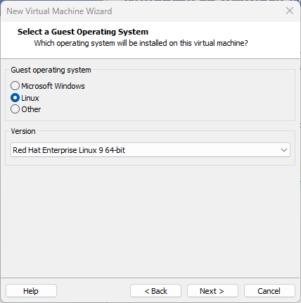

4. When the **Name the Virtual Machine** dialog appears, set the **Virtual machine name**  to *a4p*. Then, you can accept the default **Location** (VMware will place the virtual machine image in your Documents folder), or you can change it. Click **Next** when you are finished:

   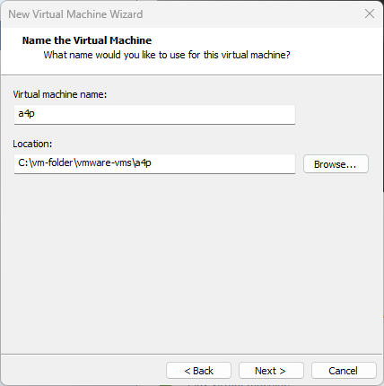

5. When the **Specify Disk Capacity** dialog appears, set the **Maximum disk size (GB)** to *20* and select **Split virtual disk into multiple files**. Click **Next** when you are finished:

   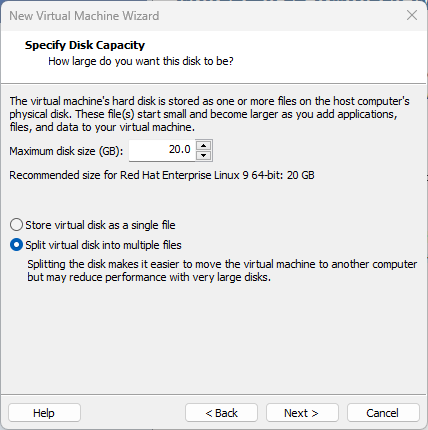

6. When the **Ready to Create Virtual Machine** dialog appears, click on **Customize Hardware...**:

   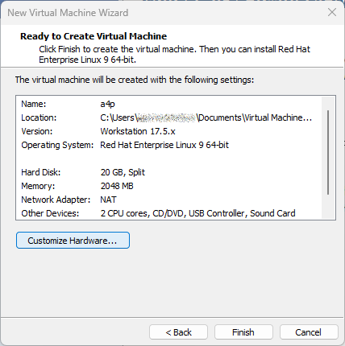

7. When the **Hardware** dialog appears, ensure that you allocate at least **2048 MB** of memory (2 GB) and **2 processors**. Once set, click on **New CD/DVD (SATA)**:

    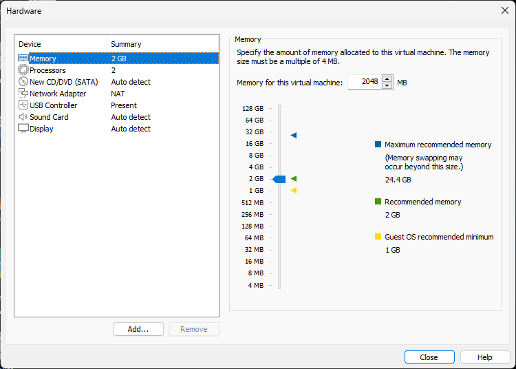

8. Select **Use ISO image file** and click on **Browse...**:

   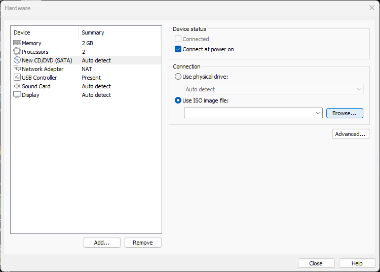

9. An Explorer dialog window should appear. Navigate to where you stored your disk image and select it:

   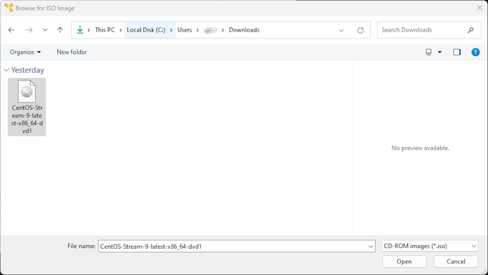

10. When you return to the **Hardware** dialog, click on **Close**:

    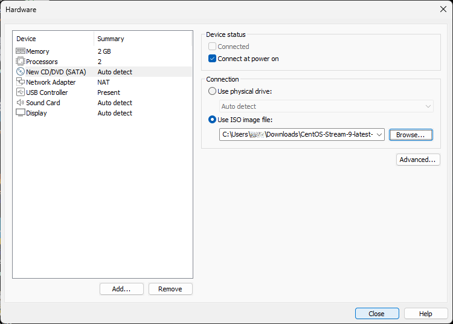

11. When you return to the **Ready to Create Virtual Machine** dialog, make sure the information is correct, then click **Finish**:

    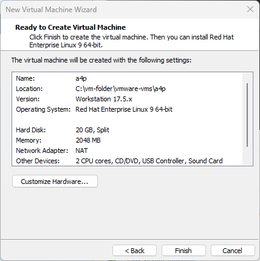

-----

## Setup CentOS

1. At the main dialog, click on **Play virtual machine**:

    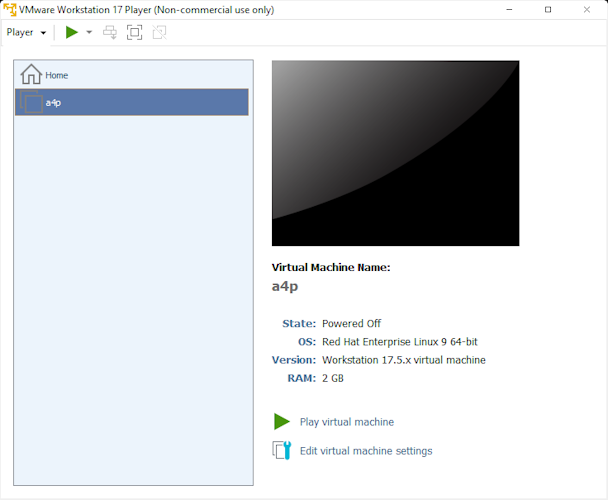

2. The GNU GRUB menu will appear. Click inside the window; it will capture your mouse cursor. Select **Install CentOS Stream 9**, then press **[Ctrl]** + **[Alt]** to release the mouse cursor:

   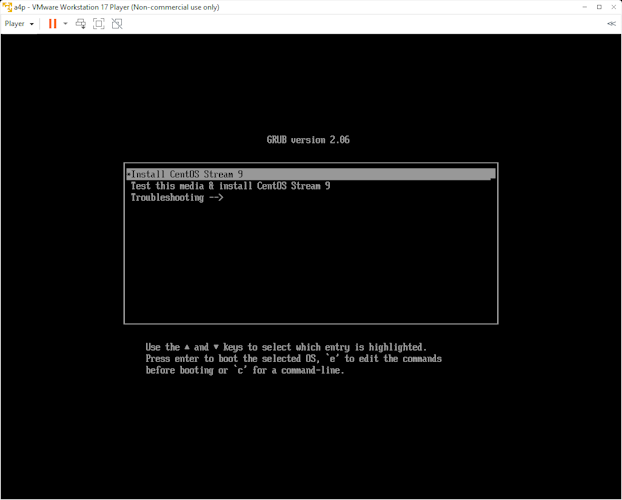

3. Wait for the installation wizard to start. When the **Welcome to CentOS Stream 9** screen appears, select your language and click on **Continue**:

   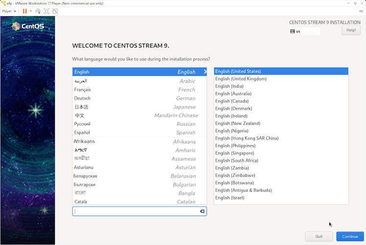

4. The **Installation Summary** should appear:

   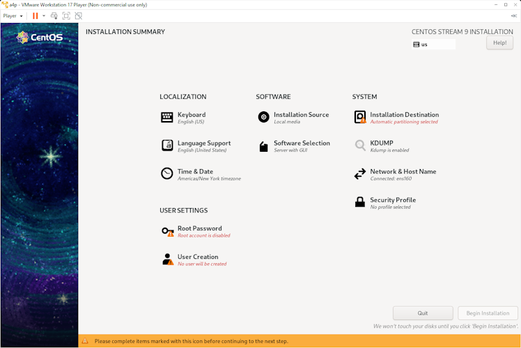

5. Under **System**, select **Installation Destination**. When the screen appears, ensure the **20 GiB VMware Virtual Disk** is checked. Accept all the other default settings by clicking on **Done**:

   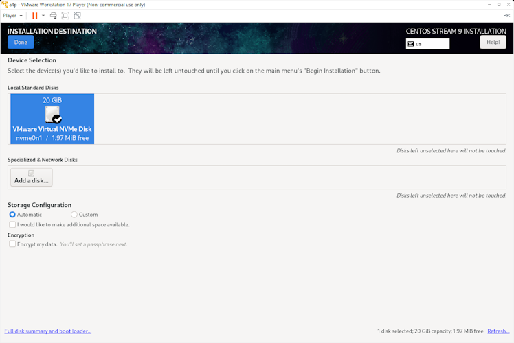

6. When you return to the **Installation Summary**, under **User Settings**, click on **Root Password**. Enter the following information and click on **Done** when finished:

   - **Root Password** - Enter a password of your choice. By the way, if the password is weak or fails a dictionary check, the wizard will warn you that you will have to click on **Done** twice to use the password.
   - **Confirm** - Re-enter the password you chose.
   - **Lock root account** - Unchecked
   - **Allow root SSH login with password** - Unchecked

   

7. When you return to the **Installation Summary**, under **User Settings**, click on **User Creation**. Enter the following information and click on **Done** when finished:

   - **Full name** - *a4puser*
   - **User name** - *a4puser*
   - **Make this user administrator** - Checked
   - **Require a password to use this account** - Checked
   - **Password** - Enter a password of your choice. By the way, if the password is weak or fails a dictionary check, the wizard will warn you that you will have to click on **Done** twice to use the password.
   - **Confirm password** - Re-enter the password you chose.

   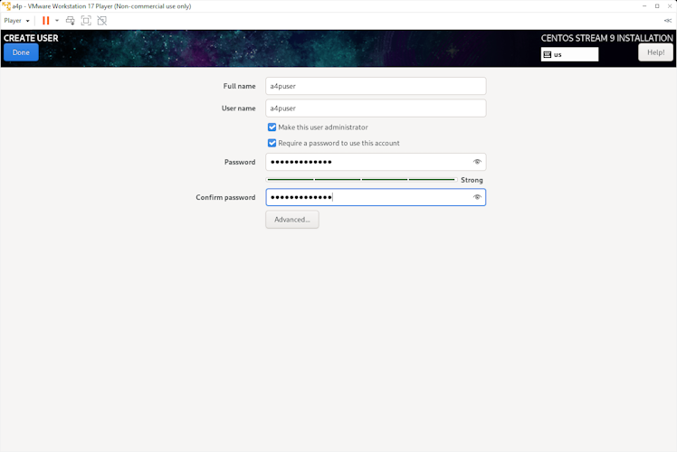

8. When you return to the **Installation Summary**, click on **Begin Installation**. The installation will start.

   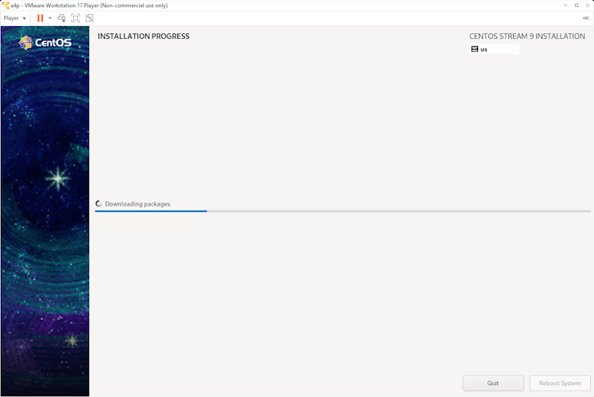

9. Once the installation is complete, click on **Reboot System**.

   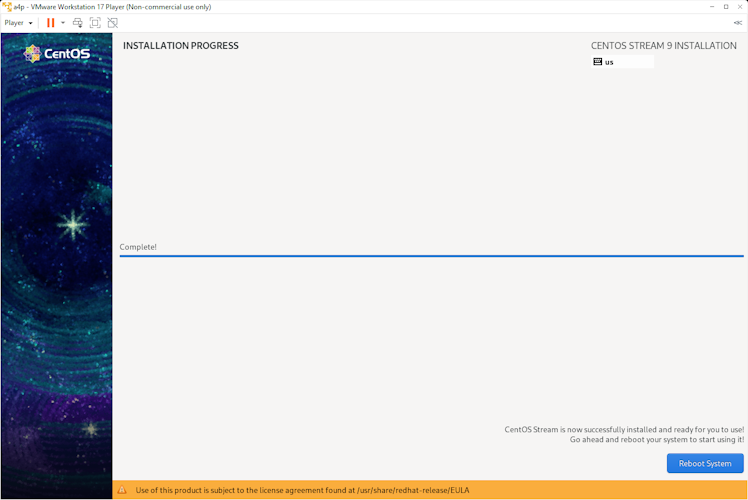

-----

## Login and Update the System

1. Once the system has finished rebooting, click on **a4puser**:

    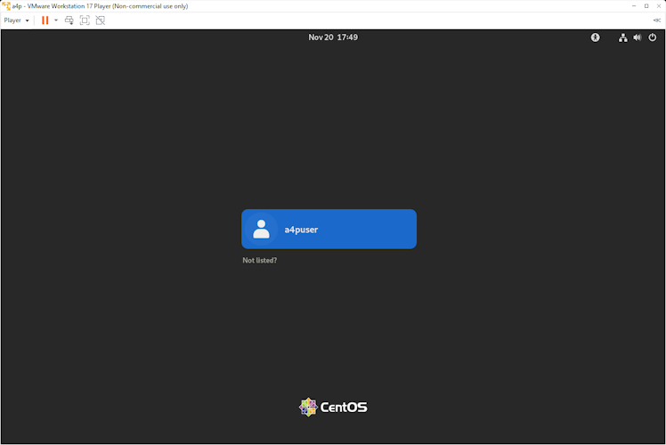

2. Enter your password in the text box and press **[Enter]**:

   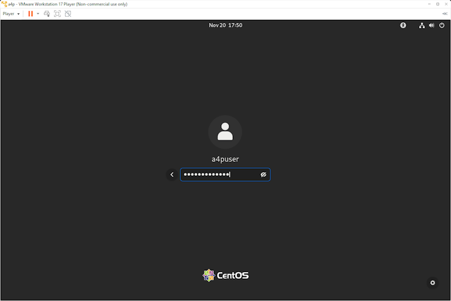

3. When the **Welcome to CentOS** dialog appears, you can take the tour or decline:

   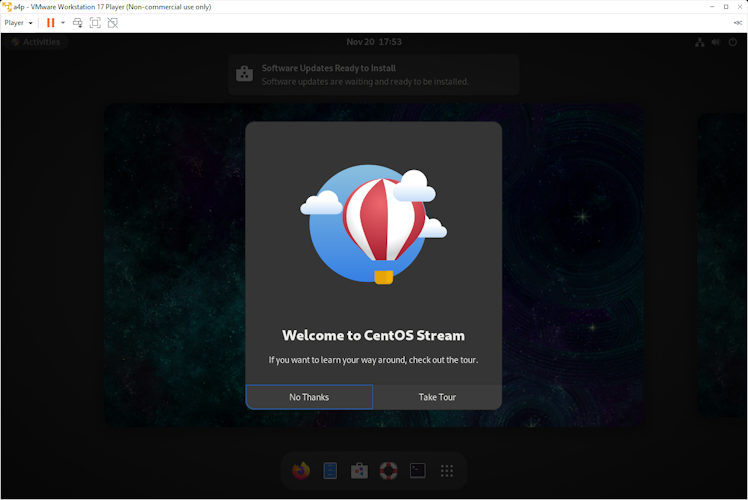

4. When you return to the main screen, click on **Activities** at the top of the screen, and then click on the **Terminal** icon at the bottom of the screen.

   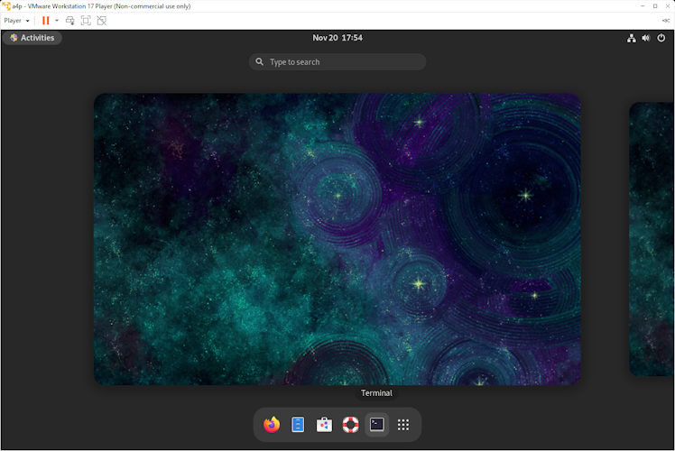

5. The Terminal window will open:

   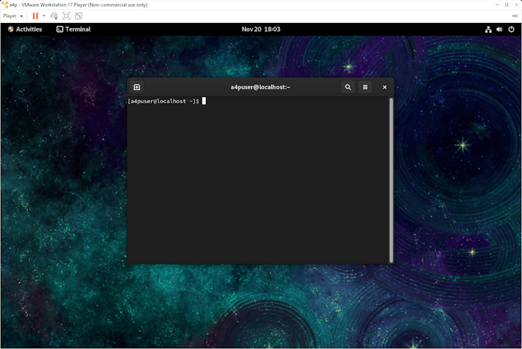

6. At the prompt, enter the following commands to ensure your system is up-to-date:

   ```bash
   sudo dnf -y update
   ```

7. Enter your password when prompted:

   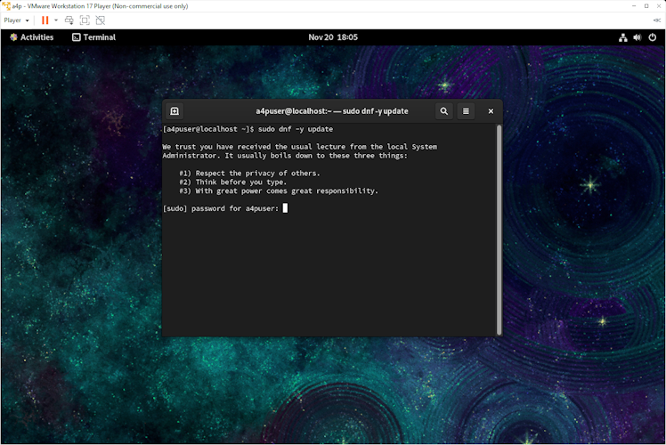

8. Once the `update` command is complete, enter the following commands at the prompt to check for upgrades and remove any packages that are no longer required.

   ```bash
   sudo dnf -y upgrade
   sudo dnf -y autoremove
   ```

9. At this time, the default Python interpreter installed in CentOS Stream 9 is Python 3.9. However, the latest version of Python available for CentOS Stream 9 is Python 3.11. Use the following commands to change the default version of Python 3; enter your password when prompted:

   ```bash
   sudo dnf install -y python3.11
   sudo update-alternatives --install /usr/bin/python3 python3 /usr/bin/python3.11 1
   python3 --version
   ```

   > **NOTE** - This action will not affect the Python interpreter used by system applications, such as `dnf` and `yum`. That interpreter is located at `/usr/libexec/platform-python`.

That's it! You now have a Linux host that you can use with the tutorial. Good luck!

[^1]: The CentOS project at <https://www.centos.org/>.
